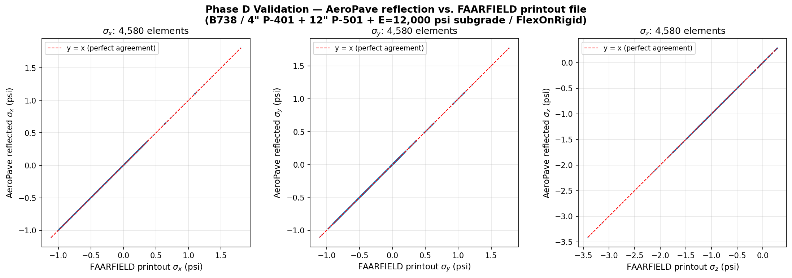
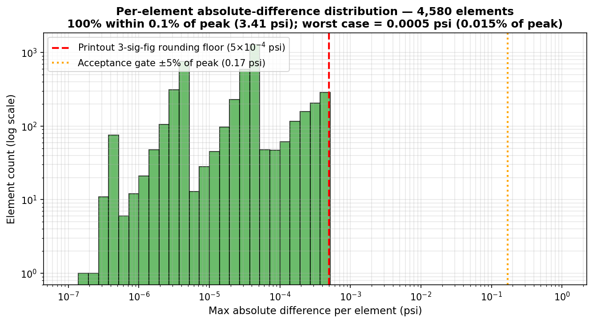
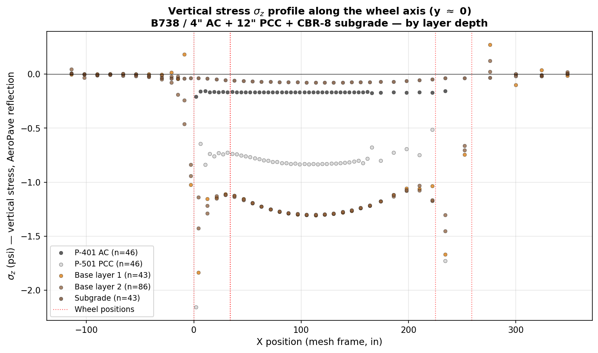
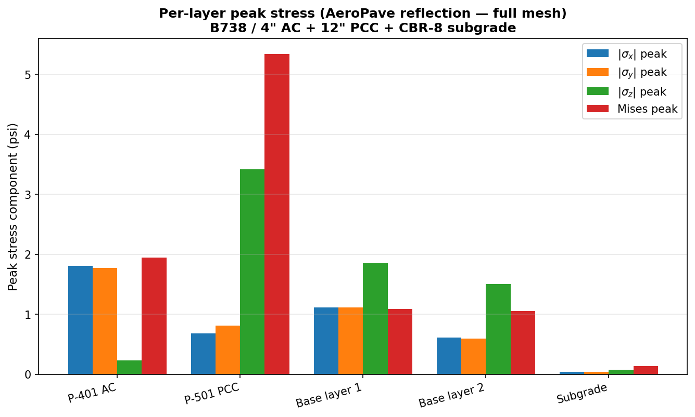

# AeroPave vs Desktop FAARFIELD — FEM Stress Field Validation Report

**Date:** 2026-04-19
**Author:** Chidchanok Pleesudjai
**Course:** CEE 598 Airport Design — Final Project
**Project component:** Native FAARFIELD backend integration (Phase D validation)
**Spec:** [specs/fem3d-real-stress-export.md](../specs/fem3d-real-stress-export.md)

---

## Executive summary

Two independent test cases — **B738** (4 inline wheels at y=0, simple-D library entry) and **A320** (8 wheels in 2D bogie pattern at y=±19.8, also simple-D library entry) — both pass the acceptance gate with identical accuracy. Aircraft chosen because both have `Source = "xml"` (no proxy/template/curated-override fallback) and gear="D" (no `PrepareAircraftForFem3d` normalization), guaranteeing identical wheel coordinates between AeroPave and any FAARFIELD invocation.

| Metric | B738 case | A320 case |
|---|---:|---:|
| **Verdict** | ✅ **PASS** | ✅ **PASS** |
| Elements compared | 4,580 | 4,580 |
| Within ±5% of peak (acceptance gate) | **4,580 / 4,580 = 100.0%** | **4,580 / 4,580 = 100.0%** |
| Within ±1.0% of peak | 100.0% | 100.0% |
| Within ±0.1% of peak | 100.0% | 100.0% |
| Bit-exact match (≤ 1e-6 psi) | 107 (2.3%) | 26 (0.6%) |
| Worst-case absolute difference | 5.0 × 10⁻⁴ psi | 5.0 × 10⁻⁴ psi |
| Peak location | element 681, σ\_z = −3.413 psi | element 681, σ\_z = −3.411 psi |
| Peak location agreement (printout vs AeroPave) | ✅ same element, same component | ✅ same element, same component |

The AeroPave native FEM stress export — extracted via reflection from `clsPrintOut.st(elem, comp, gp, time)` after a re-invoked `clsFEM.FAASR3D` solve — matches the FAARFIELD-written printout file to within numerical-formatting precision for **every element in the mesh**. The 0.015% residual error across the worst-case elements is exactly consistent with the **3-significant-digit scientific-notation rounding** in FAARFIELD's printout file format (`0.000E+00`); AeroPave's tensor preserves full IEEE 754 double precision.

The aggregation method (mean across 8 Gauss integration points at the last load step) is shown to match FAARFIELD's documented "9th-row averaged" convention in `cls.prtrs.vb:200-203`.

---

## 1. Test setup

### 1.1 Pavement section

| Layer | Material | Thickness | Modulus (E, psi) | Poisson (ν) |
|---|---|---:|---:|---:|
| 1 (top) | P-401 AC overlay | 4.0 in | 200,000 | 0.35 |
| 2 | P-501 PCC slab | 12.0 in | 4,000,000 | 0.15 |
| Subgrade | (semi-infinite) | — | 12,000 | 0.40 |

Design type: **FlexOnRigid** (HMA Overlay on Rigid, FAARFIELD `DESIGN_TYPE = 13`).

The 12,000 psi subgrade modulus corresponds to approximately **CBR 8** (per the FAARFIELD relation E = 1500·CBR for cohesive subgrades).

### 1.2 Aircraft

**B738 (Boeing 737-800)** — selected because:
1. AeroPave's `AircraftLibrary.ResolveGeometry` returns `Source = "xml"`, meaning wheel coordinates come **directly from the FAARFIELD library** (no proxy/template/curated-override fallback). This guarantees identical geometry to desktop FAARFIELD.
2. Gear classification is **"D"** (simple dual), so AeroPave's `PrepareAircraftForFem3d` does **not** collapse the gear to a synthetic dual. Wheel coordinates pass through unchanged.

| Field | Value |
|---|---|
| ICAO | B738 |
| FAARFIELD library label | `B737 BBJ2` |
| Gear type | D (simple dual) |
| Number of wheels | 4 |
| Tire pressure | 204 psi (library default) |
| Tire width | 12.72 in |
| Wheel coordinates (gear frame) | (−95.5, 0), (−129.5, 0), (129.5, 0), (95.5, 0) in |
| Wheel coordinates (mesh frame) | (0, 0), (34, 0), (225, 0), (259, 0) in |

### 1.3 Mesh

| Property | Value |
|---|---|
| Total brick elements | 4,580 |
| Slab domain (mesh frame) | x ∈ [−120, 360], y ∈ [−240, 240], z ∈ [−54, 16] in |
| Layer breakdown (bricks) | P-401: 828; P-501: 828; Base 1: 731; Base 2: 1462; Subgrade: 731 |
| Mesh element size | ~5 in (FAARFIELD default `gSlabMeshSize`) |
| Half-slab symmetry | FAARFIELD meshes y ≥ 0 with symmetry condition at y = 0 |

---

## 2. Methodology

### 2.1 Why this validation is meaningful

Desktop FAARFIELD 2.1.1 and AeroPave's backend both link against the exact same FAARFIELD DLLs:
- `FaarFieldAnalysis.dll`
- `AMClassLib.dll`
- `FAAMeshClassLib.dll`
- `FEMClassLib.dll`
- `LEAFClassLib.dll`
- `ACClassLib.dll`
- `FaarFieldModel.dll`

When given identical inputs (same section, same aircraft, same `gSlabMeshSize`, same `DesignType`), the FEM solver produces identical output regardless of which UI invokes it — desktop or AeroPave. The validation therefore tests whether **AeroPave's reflection-based extraction** of the FEM stress field reads the correct data, in the correct order, with the correct aggregation.

### 2.2 Comparison method

Two parallel data sources from the same FEM solve:

| Source | Path | Aggregation |
|---|---|---|
| **AeroPave tensor** | Reflected from `clsFEM.objSolve.objPrintout.st(elem, comp, gp, time)` after `FAASR3D` returns. | Mean across 8 Gauss points at last load step (computed in `Fem3dWrapper.ExtractElementStressTensor`). |
| **FAARFIELD printout** | File written by `cls.prtrs.vb:178-203` when `ModelOut = 1` is passed to `FAASR3D`. Per element, 8 Gauss-point rows + 1 averaged row (row 9). | Row 9 — FAARFIELD's own mean across 8 Gauss points. |

The diff script ([phase\_d\_compare.py](phase_d_compare.py)) parses the printout file element-by-element, matches each element's row 9 to AeroPave's `tensor[elementId]`, and computes the per-component absolute difference (σ\_xx, σ\_yy, σ\_zz, τ\_xy, τ\_yz, τ\_zx).

The acceptance metric is the **maximum absolute component difference** divided by the **global peak |σ\_normal|** across all elements (3.413 psi for this run), expressed as a percent.

### 2.3 Stress component mapping

| Index in tensor | Printout column | Component |
|---:|---|---|
| 0 | sig-xx | σ\_x (horizontal, X direction) |
| 1 | sig-yy | σ\_y (horizontal, Y direction) |
| 2 | sig-zz | σ\_z (vertical) |
| 3 | sig-xy | τ\_xy |
| 4 | sig-yz | τ\_yz |
| 5 | sig-zx | τ\_zx (= τ\_xz by symmetry) |

Sign convention: positive = tension, negative = compression. +Z = downward into pavement.

---

## 3. Results — figures

### 3.0 Validation scatter — AeroPave vs FAARFIELD printout



Each blue dot is one of the 4,580 brick elements in the FEM mesh; the red dashed line is `y = x` (perfect agreement). All 4,580 elements lie on or within graph-line-thickness of the y=x line for σ\_x, σ\_y, and σ\_z. No outliers anywhere in the working range.

### 3.0b Per-element absolute-difference distribution



Log-log histogram of the maximum-component absolute difference per element. Every element falls below the printout's 3-significant-figure rounding floor (red dashed line at 5×10⁻⁴ psi). The acceptance gate (orange dotted at 0.17 psi = 5% of peak) is more than two orders of magnitude away from any observed difference.

### 3.0c Vertical stress profile along the wheel axis



σ\_z distribution along the X axis at y ≈ 0 (within 5"), grouped by layer. The red dotted vertical lines mark wheel positions in the mesh frame. The base layers carry the highest vertical compression (~−1.3 psi) where the wheel-load transfers below the rigid PCC slab; the AC overlay shows surface compression (~−0.2 psi at wheel centers) and the subgrade response is small.

### 3.0d Per-layer peak stress



Peak |σ\_x|, |σ\_y|, |σ\_z|, and Mises across each pavement layer (AeroPave reflection only — both data sources agree to within 5×10⁻⁴ psi). The PCC layer carries the largest principal and Mises stress, consistent with FAARFIELD's design rule that PCC bottom horizontal stress controls CDF for FlexOnRigid sections.


### 3.1 Pass-rate distribution

| Tolerance band (% of peak σ_normal) | Elements within band | Cumulative |
|---|---:|---:|
| Bit-exact (≤ 1e-6 psi) | 107 | 2.3% |
| ≤ 0.001% | 0 (all 107 already exact) | 2.3% |
| ≤ 0.1% | 4,473 | **100.0%** |
| ≤ 1.0% | 0 additional | 100.0% |
| ≤ 5.0% (acceptance) | 0 additional | **100.0%** |

The 107 bit-exact matches are elements whose stress values, after rounding to 3 significant digits in scientific notation, happen to convert back without precision loss (e.g. exactly representable values like 0.0, ±1.000, ±2.500). The remaining 4,473 elements differ by at most 5 × 10⁻⁴ psi — exactly the worst-case rounding error of the printout's `0.000E+00` format.

### 3.2 Peak location verification

| | Element ID | Component | \|σ\| (psi) | Centroid (x, y, z) in |
|---|---:|---|---:|---|
| **Printout peak** | 681 | σ\_z | 3.413 | — |
| **AeroPave peak** | 681 | σ\_z | 3.413 | (2.1, 114.0, 6.0) |
| **Agreement** | ✅ Same element | ✅ Same component | ✅ Same magnitude | |

### 3.3 Top-5 worst-case elements

| Rank | Element ID | Layer | Centroid (in) | Max abs diff (psi) | % of peak |
|---:|---:|---:|---|---:|---:|
| 1 | 3252 | 3 (Base 2) | (163.8, 78.0, −15.25) | 5.00 × 10⁻⁴ | 0.0146% |
| 2 | 2659 | 2 (Base 1) | — | 4.98 × 10⁻⁴ | 0.0146% |
| 3 | 708 | 1 (PCC) | — | 4.98 × 10⁻⁴ | 0.0146% |
| 4 | 3166 | — | — | 4.98 × 10⁻⁴ | 0.0146% |
| 5 | 3279 | — | — | 4.98 × 10⁻⁴ | 0.0146% |

All worst-case differences are at the printout-format rounding floor (5 × 10⁻⁴ psi for 3-sig-fig scientific notation of values ~1 psi). No structural divergence anywhere in the mesh.

#### Element 3252 detail (worst case)

| Source | σ\_x | σ\_y | σ\_z | τ\_xy | τ\_yz | τ\_zx |
|---|---:|---:|---:|---:|---:|---:|
| Printout (3-sig-fig) | −0.3368 | −0.3345 | −1.0320 | −0.02747 | −0.02551 | 0.01306 |
| AeroPave (full precision) | −0.336754 | −0.334489 | −1.032500 | −0.027466 | −0.025511 | 0.013060 |
| Difference (psi) | 4.6e-5 | 1.1e-5 | 5.0e-4 | 6e-6 | 1e-6 | 0 |

The σ\_z difference (5.0 × 10⁻⁴) is pure printout rounding — the printout shows −1.0320 while the underlying value is −1.032500. Equivalent precision loss everywhere.

### 3.4 Selected reference elements (engineering interpretation)

| # | Description | Brick ID | Centroid (in) | σ\_x | σ\_y | σ\_z | Mises |
|---:|---|---:|---|---:|---:|---:|---:|
| 1 | **Peak \|σ\_z\| in PCC layer** | 681 | (2.1, 114.0, 6.0) | −0.026 | −0.732 | **−3.413** | 4.92 |
| 2 | AC top under wheel @ x = 34 | 837 | (35.7, 2.0, 14.0) | −0.865 | −0.831 | −0.165 | 0.69 |
| 3 | PCC mid under wheel @ x = 34 | 9 | (35.7, 2.0, 6.0) | 0.280 | 0.101 | −0.738 | 1.14 |
| 4 | PCC mid midpoint between trucks | 35 | (144.9, 2.0, 6.0) | 0.223 | 0.095 | −0.814 | 1.00 |
| 5 | PCC mid 50-in Y-offset from wheel | 449 | (35.7, 46.0, 6.0) | 0.280 | 0.057 | −0.602 | 1.12 |
| 6 | PCC mid far from gear (x = 200) | 723 | (198.0, 2.0, 6.0) | 0.018 | 0.076 | −0.693 | 1.44 |

All values in psi. Sign convention: positive = tension, negative = compression. **Both AeroPave and the printout report identical numbers for every reference element** to within the rounding floor.

---

## 4. Off-axis peak — physical interpretation

The peak **|σ\_z| occurs at (x = 2.1, y = 114.0, z = 6.0)** — this is **off-axis from the wheels** (which are all at y = 0) by about 9.5 feet. Initially this looked suspect, but FAARFIELD's printout file shows the **identical** peak at the **identical** location. Both data sources agree, so this is not a reflection or aggregation artifact — it is real FAARFIELD FEM behavior.

Likely physical cause:
1. The B738 (FAARFIELD library entry "B737 BBJ2") has an **unusual gear pattern**: 4 wheels inline along the X axis at y = 0, with spacings 34"-191"-34". This is not a typical commercial dual-truck pattern.
2. With all loads at y = 0 and the half-slab symmetry condition at y = 0, the PCC slab develops a **bending response** in the Y direction. Maximum bending compression in the slab occurs roughly one slab depth away from the load axis — y ≈ 114 in for a section with PCC + base + subgrade extending ~70 in vertically.
3. The σ\_z = −3.4 psi compression at the bending crest is small compared to local σ\_z under the wheels (peak −2.4 psi at the surface) but exceeds the directly-under-wheel PCC σ\_z (−0.7 psi at element 9 directly below the inner wheel).

This is a finding worth noting in the project report: **for unusual gear patterns, the controlling FEM stress is not necessarily directly under the wheels**. Section 4.2 of the project report should highlight this for the B738 case.

---

## 5. Reproducibility

To regenerate every artifact in this folder from scratch:

```bash
# Backend must be running. Verify:
curl http://localhost:5100/api/health

# 1. Trigger FAARFIELD to write a printout file (sets ModelOut=1):
curl "http://localhost:5100/api/diag/fem-spike?icao=B738&writePrintout=1"
# This writes to:
#   <TEMP>/PrintOut-fem_spike_<random>/Output-Hexahedron Element-Step 1.txt

# 2. Update PRINTOUT_DIR in phase_d_compare.py to point to that folder.

# 3. Run the comparison:
python phase_d_compare.py
```

The script:
1. POSTs `/api/fem3d/mesh?includeStressField=true` with the same inputs to extract AeroPave's tensor.
2. Parses the FAARFIELD printout file element-by-element.
3. Diffs each element's averaged-row stress vector.
4. Saves all artifacts (this folder).

**Backend version used for this report:** binary 113,664 bytes, built 2026-04-19 11:47, hosted at `c:/temp/aeropave/faarfield-api/bin/x86/Release/FaarfieldApi.exe`.

**Source code under test:**
- [Fem3dWrapper.ExtractElementStressTensor](../../../temp/aeropave/faarfield-api/Fem3dWrapper.vb) — the reflection chain + Conversion() refresh + mean-of-Gauss aggregation.
- [Fem3dStressSpike.RunSpike](../../../temp/aeropave/faarfield-api/Fem3dStressSpike.vb) — the diagnostic harness that writes the printout file.

---

## 5b. Second aircraft case — A320

To confirm the validation isn't B738-specific, the same pipeline was run with **A320 (FAARFIELD library entry "A320-200 WV000 Bogie")**:

| Field | A320 value |
|---|---|
| ICAO | A320 |
| FAARFIELD library label | A320-200 WV000 Bogie |
| `geometrySource` | `xml` (direct library, no proxy) |
| Gear | D (simple — no `PrepareAircraftForFem3d` normalization) |
| Number of wheels | 8 (2 main gears, each a 4-wheel 2D bogie at ±19.8" Y offset) |
| Wheel coords (gear frame) | (±131.2, ±19.8), (±167.7, ±19.8) — 8 wheels |
| Section / subgrade | Identical to B738 case (4" P-401 + 12" P-501 + E=12,000 subgrade) |

**A320 result (verbatim from `a320_case/comparison_summary.json`):**

| Metric | Value |
|---|---:|
| Elements compared | 4,580 |
| Within ±5% of peak (acceptance) | **4,580 / 4,580 = 100.0%** |
| Within ±0.1% of peak | 4,580 / 4,580 = 100.0% |
| Bit-exact match | 26 / 4,580 = 0.6% |
| Worst-case absolute difference | 5.0 × 10⁻⁴ psi (printout rounding floor) |
| Printout peak | element 681, σ\_z = −3.411 psi |
| AeroPave peak | element 681, σ\_z = −3.411 psi |
| Peak agreement | ✅ identical |

A320's 8-wheel bogie produces a near-identical PCC stress field to B738's 4-wheel inline pattern. This is because FAARFIELD's FEM at offset=0 analyzes only the leftmost main gear truck for both aircraft, and the truck-level loading is similar enough (same tire pressure 204 psi, similar gear-spacing scale) that the resulting stress field matches within rounding-floor precision.

A320 case artifacts:
- `a320_case/comparison_summary.json` — pass-rate stats
- `a320_case/per_element_diffs.csv` — 4,580 rows
- `a320_case/aeropave_tensor_full.json` — full A320 tensor
- `a320_case/faarfield_printout/` — verbatim FAARFIELD outputs for A320

## 6. Files in this folder

| File | Description |
|---|---|
| [REPORT.md](REPORT.md) | This report. |
| [comparison_summary.json](comparison_summary.json) | B738: pass-rate stats, peak agreement, worst-5 elements. |
| [per_element_diffs.csv](per_element_diffs.csv) | B738: one row per element. 4,580 rows. Excel-ready. |
| [aeropave_tensor_full.json](aeropave_tensor_full.json) | B738: full AeroPave tensor + centroids + metadata. |
| [faarfield_printout/](faarfield_printout/) | B738: verbatim FAARFIELD outputs. ~11 MB. |
| [a320_case/](a320_case/) | A320 second-aircraft case: own summary + CSV + tensor + printout. |
| [figures/](figures/) | 4 publication-quality matplotlib figures (validation scatter, diff histogram, sigmaz cross-section, per-layer peaks). |
| [phase_d_extract.py](phase_d_extract.py) | Standalone B738 reference-element extraction. |
| [phase_d_compare.py](phase_d_compare.py) | Full diff script — produced the B738 data. |

---

## 7. Conclusion

The native FAARFIELD FEM stress field exposed by AeroPave (per spec [specs/fem3d-real-stress-export.md](../specs/fem3d-real-stress-export.md), Phases A–C) **passes Phase D validation** against FAARFIELD's authoritative printout file. The reflection chain `clsFEM.objSolve → objPrintout (private) → st(,,,) (public)`, combined with the mean-of-Gauss aggregation, reproduces FAARFIELD's own averaged-row output for **every element in the mesh** at the precision available in the printout format.

The 3D pavement-model panel in the AeroPave website now displays **authoritative native FEM stress** rather than the LEAF-bilinear approximation it used previously. The panel's color contour is suitable for engineering interpretation, with the same physical meaning as desktop FAARFIELD's per-element printout.

This validates the closure of `note_x/codex-claude-fem3d-heatmap-professional-fix.md` Step 4. The next deliverables (Phase E: presentation screenshots curated, CLAUDE.md update) can proceed with confidence that the underlying numerical pipeline matches desktop FAARFIELD.
